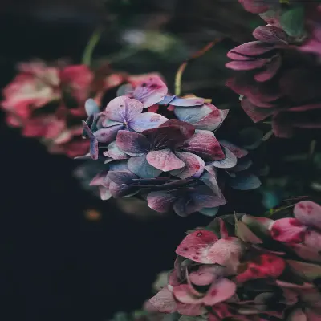

# pixlated

[](https://www.npmjs.com/package/pixlated)
[](https://github.com/Bridgetamana/pixlated/graphs/contributors)
[]((https://www.npmjs.com/package/pixlated))
[](https://github.com/Bridgetamana/pixlated/stargazers)

A lightweight web components that add noise textures to images and backgrounds using Canvas API.
[View Live Demo](https://bridgetamana.github.io/pixlated/)

[NPM Package](https://www.npmjs.com/package/pixlated)

## Effect Preview

See the subtle noise effect `pixlated` adds to an image.

Before (Original)


After (With `<pixlated-image>`)


## Features

- Two web components: `<pixlated-image>` and `<pixlated-bg>`
- Zero dependencies
- Built with native Web Components API
- High-performance Canvas rendering
- Responsive and accessible

## Installation

### NPM

```bash
npm install pixlated
```

### CDN

Load both components

```html
<script src="https://unpkg.com/pixlated/src/pixlated.js"></script>
<script src="https://unpkg.com/pixlated/src/pixlated-bg.js"></script>
```

Or load individually:

```html
<!-- Just image component -->
<script src="https://unpkg.com/pixlated/src/pixlated.js"></script>
```

```html
<!-- Just background component -->
<script src="https://unpkg.com/pixlated/src/pixlated-bg.js"></script>
```

## Usage

### With Bundlers (Vite, Webpack, etc)

```javascript
import 'pixlated';
// Now you can use <pixlated-image> in your HTML
```

### Image Grain Effect

Add noise texture to images:

```html
<pixlated-image
  src="photo.jpg"
  intensity="0.3"
  width="400"
  height="400"
  alt="Photo with grain effect"
/>
```

**Attributes:**

| Attribute | Default | Description |
|-----------|---------|-------------|
| `src`  | required | Image URL|
| `intensity`  | 0.1 | Noise intensity from 0 to 1 |
| `width`  | 400 | Canvas width in pixels |
| `height`  | 400 | Canvas height in pixels |
| `alt`  | optional | Alternative text for accessibility |

### Background Noise Effect

Add noise texture to backgrounds:

```html
<pixlated-bg intensity="0.15" color="#09090b">
  <h1>Your content here</h1>
  <p>Perfect for hero sections, cards, and more</p>
</pixlated-bg>
```

**Attributes:**

| Attribute | Default | Description |
|-----------|---------|-------------|
| `intensity` | 0.1 | Noise intensity from 0 to 1 |
| `color` | #09090b | Background color |
| `width` | auto-sizes | Fixed width in pixels |
| `height` | auto-sizes | Fixed height in pixels |

### Styling

Style components with CSS:

```css
pixlated-image {
  border-radius: 12px;
  box-shadow: 0 4px 6px rgba(0, 0, 0, 0.1);
}

pixlated-bg {
  padding: 2rem;
  border-radius: 8px;
}
```

## Contributing

Contributions are welcome! Please read [CONTRIBUTING.md](CONTRIBUTING.md) for guidelines.

## License

License under [Apache-2.0](LICENSE)

Give the repo a star if you haven't already
